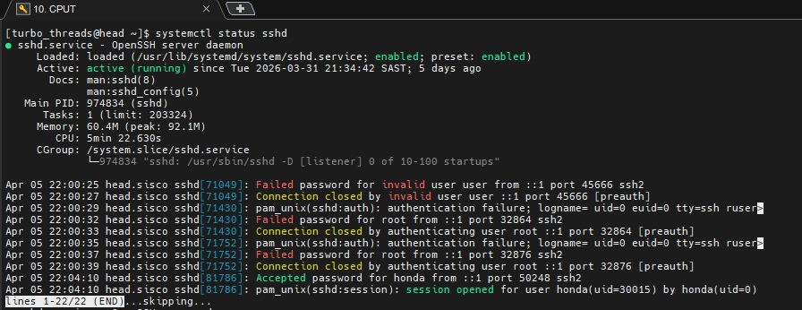
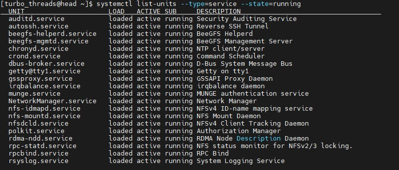
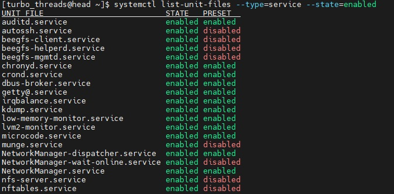
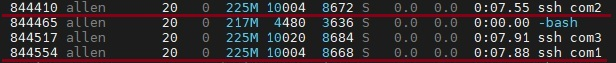
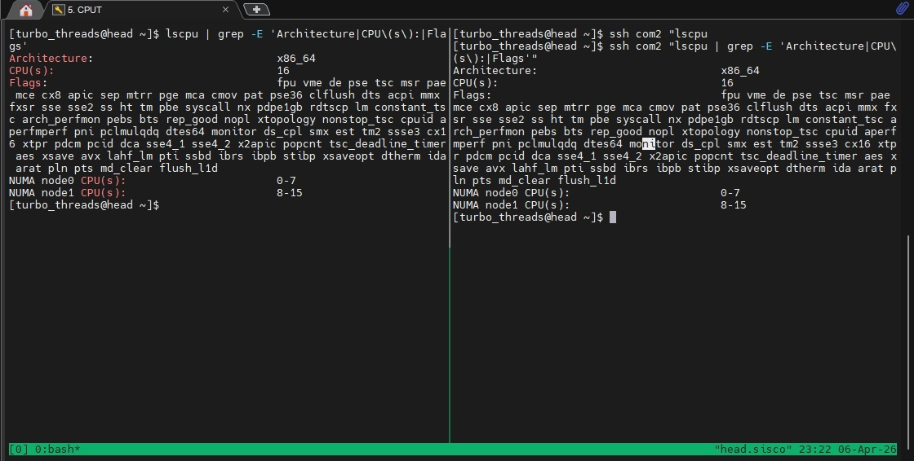
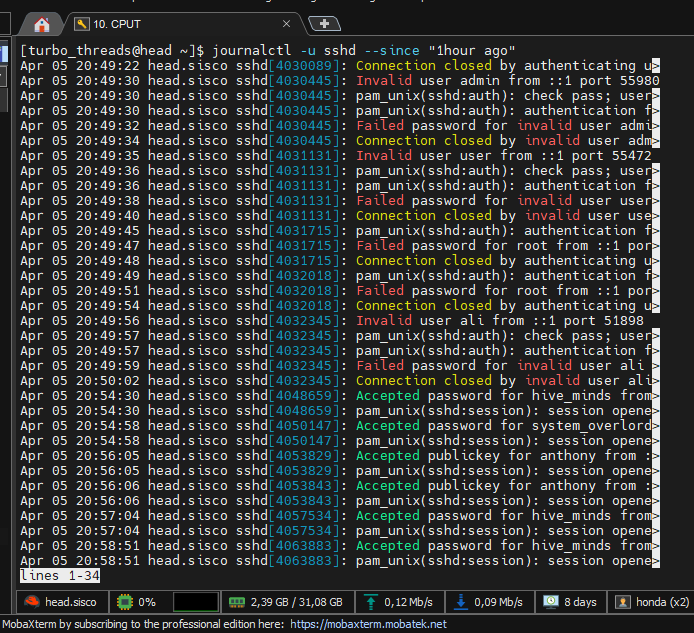

## SSH service status on head node

## Running services:

## Enabled services:

## SSH process identified

## Head and com2 CPU details:

## SSH logs (1 hour):

**Please note that the image only shows some of the logs. The number of logs was too many to capture.**
