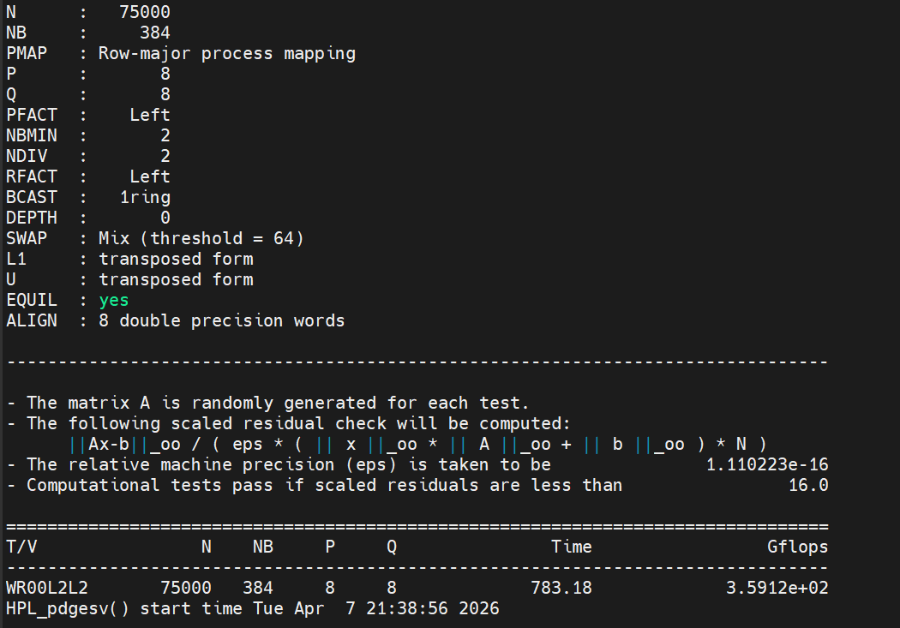

# Task 5 - HPL Benchmark Proof

## Team: Turbo_Threads
- Ntokozo
- Thapelo
- Carl
- Duy

## Best Score: 359.12 Gflops

## Configuration
- N = 75000
- NB = 384
- P = 8, Q = 8
- Nodes = 4
- Cores per node = 16
- Total cores = 64

## Commands Used
cd ~/scc26/task5
sbatch run_hpl.sh
grep Gflops HPL.out

## Output
WR00L2L2       75000   384     8     8             783.18             3.5912e+02

## Screenshot

## Result
Score: 359.12 Gflops. PASSED residual check.
